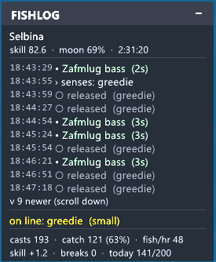

# FishLog

FishLog keeps a running log of your fishing on screen. FFXI only shows a couple of chat lines and your catches quickly scroll away into the rest of the spam, so FishLog puts every result in a small window you can drag wherever you like: what you caught, how long the fight took, misses, line and rod breaks, skill-ups, and monsters. It also tells you what's on your line before you reel it in.

FishLog only watches, it never casts or reels for you. It doesn't inject packets or automate anything, it simply reads the same chat and game data you already see, so it's safe to run alongside however you like to fish.

## Installing

1. Put the addon in a folder named `fishlog` inside your Windower `addons` directory, so you end up with `Windower4/addons/fishlog/fishlog.lua`. If you downloaded it as `ffxi-fishlog`, just rename the folder to `fishlog`.
2. In game, run `//lua load fishlog`.
3. To load it automatically every time, add `lua load fishlog` to `scripts/init.txt`. Loading it on startup is a good idea so the daily catch counter stays accurate.

## What you see

- **History**: every catch, miss, lost catch, break, skill-up, and monster, each with a timestamp. Catches show the fish's level and how long the fight lasted.
- **On the line**: when something bites, FishLog names it before you land it, so you know whether it's the fish you want or a piece of junk.
- **Monster warning**: if a monster grabs your line you get a red alert and a sound before you reel it into your face.
- **Tracked catches**: `//fl track rusty` plays a chime and highlights the log whenever you catch anything with "rusty" in the name. Handy for quest or goal fishing while you watch something else.
- **Daily counter**: how many fish you've caught today toward the 200 per day fatigue limit, which resets at the same time as the game.
- **Session stats**: casts, catch rate, fish per hour, skill gained, and breaks.

## Commands

Use `//fishlog` or the short `//fl`.

| Command | What it does |
|---|---|
| `//fl` | Show or hide the window |
| `//fl clear` | Start a fresh session |
| `//fl tally` | Print a count of everything you've caught |
| `//fl track <name>` | Chime and highlight when you catch a matching fish |
| `//fl untrack <name>` | Stop tracking |
| `//fl stats <fish>` | Where, when, and how you catch a fish (see below) |
| `//fl lines <n>` | How many history rows to show |
| `//fl compact` | Hide the history and show just the stats |
| `//fl sound on/off` | Turn sounds on or off |
| `//fl help` | Full command list in game |

Drag the window to move it. Scroll the mouse wheel over it to page back through older entries. Right-click toggles compact mode.

## Fish stats

`//fl stats crayfish` looks back over everything you've caught and tells you where a fish bites, which bait works, which rod lands it best, and the moon, weather, and time of day it likes. A short summary prints to chat, and a full report is saved as a text file you can paste onto a forum or into Discord.

Because FishLog identifies fish the moment they bite, casts that ended in a break or a lost catch still count, so the numbers cover more than just the fish you landed. Every rate shows how many casts it's based on, and anything with too few casts is flagged so you know to take it with a grain of salt. Run `//fl stats` on its own to list every fish it has data for.

## Sharing data with friends

FishLog quietly records each cast so your `//fl stats` get better the more you fish. `//fl export` bundles yours into a single file, and if a friend sends you theirs, drop it into the `data/import` folder and their catches join your reports automatically. No character names are stored in the shared file. If you'd rather not record anything, `//fl research off` turns it off.

## Sounds

The chime and monster alarm are ordinary `.wav` files in the `sounds` folder. Swap in your own if you want different ones.

## Credits

The live catch identification is based on work from Seth VanHeulen's fisher addon. FishLog is released under the GPL-3.0 license.
